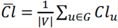
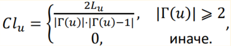
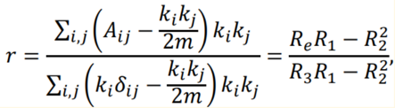

# NetLinkAnalyze
## Описание/Description:
### RU:
Аннотация: Программа «NetLinkAnalyze» предназначена для вычисления признакового описания связей в крупномасштабных сетях для дальнейшего обучения классификатора и предсказания появления новых связей в последующие моменты времени, а также для расчёта характеристик статических графов, включающий количество вершин и ребер, плотность, компоненты слабой связности, радиус, диаметр сети и коэффициент ассортативности. Обеспечивает получение результатов в удобном для анализа формате - LaTeX таблицы с эффективным использованием памяти вычислительного устройства для работы с крупномасштабными сетями.

К преимуществам данной программы (по отношению к известным) относятся:
* Использование эффективной структуры данных для хранения и работы с большими сетями;
* Построение LaTeX таблиц для представления результатов работы функций;
* Низкий порог входа для начала использования;
* Эффективное использование памяти с помощью принудительного удаления неиспользуемых объектов;
* Архитектура программы позволяет легко добавлять новые функции или модули для расширения её функциональности.

### ENG:
Abstract: The «NetLinkAnalyze» program is designed to calculate the characteristic description of connections in large-scale networks for further training the classifier and predicting the appearance of new connections at subsequent points in time, as well as to calculate the characteristics of static graphs, including the number of vertices and edges, density, components of weak connectivity, radius, diameter of the network and the coefficient of assortativity. It provides results in a format convenient for analysis - LaTeX tables with efficient use of the memory of a computing device for working with large-scale networks.

The advantages of this program (in relation to the known ones) include:
* Using an efficient data structure for storing and working with large networks;
* Building LaTeX tables to represent the results of functions;
* Low entry threshold to start using;
* Efficient use of memory by forcibly deleting unused objects;
* The architecture of the program makes it easy to add new functions or modules to expand its functionality.

## Documentation/Документация:
https://romiconez.github.io/NetLinkAnalyze/

## How to use:

(Data: https://github.com/RomiconEZ/CFLG/tree/main/tests/email-Eu-core-temporal-Dept3)

    pip install NetLinkAnalyze
    --------------------------
    from pathlib import Path
    import pandas as pd
    from IPython.core.display_functions import display
    from sklearn import linear_model, pipeline, preprocessing
    from cflg import graph_features_auc_score_tables, features_for_edges_of_static_graph

    def test_graph_features_auc_score_tables() -> None:
        cls_model = pipeline.make_pipeline(
            preprocessing.StandardScaler(), linear_model.LogisticRegression(max_iter=10000, n_jobs=-1, random_state=42)
        )
    
        Networks = ["email-Eu-core-temporal-Dept3"]
    
        current_path = Path(__file__).parent
        networks_files_names = [str(current_path / name / f"out.{name}") for name in Networks]
    
        datasets_info = {
            "Network": Networks,
            "Label": ["EU"],
            "Category": ["Social"],
            "Edge type": ["Multi"],
            "Path": networks_files_names,
        }
    
        datasets_info = pd.DataFrame(datasets_info)
        datasets_info = datasets_info.iloc[0:1]
        
        (
            latex_feature_network_table_1,
            latex_feature_network_table_2,
            latex_feature_network_table_3,
            latex_feature_network_table_4,
            latex_auc_table,
        ) = graph_features_auc_score_tables(datasets_info, cls_model=cls_model, verbose=True)
       
        print(latex_feature_network_table_1)
        print(latex_feature_network_table_2)
        print(latex_feature_network_table_3)
        print(latex_feature_network_table_4)
        print(latex_auc_table)
        return

    def test_features_for_static_graph() -> None:
        def display_dataframe(df):
            with pd.option_context("display.max_columns", None):  # Показать все колонки
                display(df.head(5))  # Вывести первые 5 строк
    
        current_path = Path(__file__).parent
        name = "email-Eu-core-temporal-Dept3"
        path_to_data = str(current_path / name / f"out.{name}")
    
        X = features_for_edges_of_static_graph(path_to_data, verbose=True)
    
        return

## Feature calculation
First, we computed for each edge 3 weights from its timestamp.
Then for each node we take the edges adjacent to it, that is, we get 3 lists of weights of adjacent edges 
(so the edge has 3 weights and the lists contain weights calculated using one formula), 
then we apply one of 7 functions to the resulting list: quantiles, sum , average. 3 lists, 7 aggregation functions -> 21 numbers. 
These 21 numbers are signs of node activity (because we took edges adjacent to a certain node)
Thus, each node has 21 features. Now you need to define a feature description for an edge, an edge connects 2 vertices, 
2 vertices have a feature description, then we combine the features of these two vertices using 4 functions, 
that is, each feature of the first vertex with each feature of the second vertex, i.e. 21 * 4 = 84

## Properties of networks (for static graphs)
1. The following characteristics are calculated for each of the networks:
* the number of vertices,
* the number of ribs,
* density (the ratio of the number of ribs to the maximum possible number of ribs),
* the number of components of weak connectivity,
* the fraction of vertices in the maximum power component of weak connectivity.
2. For the largest component of weak connectivity the values of radius, network diameter, 90th percentile distance (geodesic) between graph vertices are calculated/estimated.
The evaluation is conducted on the basis of:
* Calculate distances between 500 (1000) randomly chosen vertices from the largest component of weak connectivity;
* Calculate distances by a snowball sample subgraph constructed by the following principle: a small initial set of vertices (2 or 3) is chosen, then all their neighbors are added, then neighbors of neighbors, etc., until the number of vertices in the subgraph equals (approximately) a given value (for example, 500 or 1000).
3. For the largest component of weak connectivity the average cluster coefficient of the network is calculated

Г(u) - set of neighbors of the vertex

|Г(u)| - degree of the vertex

Lu - number of edges between neighbors

4. Assortativity coefficient by degree of vertices -1 ≤ 𝑟 ≤ 1 (Pearson correlation coefficient)

The case when in the network the vertices of small degree are connected to the vertices of large degree more often corresponds to the negative values of the coefficient 𝑟 < 0.

## Predicting the appearance of edges in a graph
For prediction it is necessary first to construct a feature description for each potential edge (vector/set of features) 𝑋(𝑢,𝑣) , and the answer 𝑦(𝑢,𝑣) , which takes the value 𝑦(𝑢,𝑣) = 1 if the edge appears in the graph, and 𝑦(𝑢,𝑣) = 0 otherwise. 

A. Construction of feature vectors to predict the appearance of edges in a graph

Б. Binary classification.

